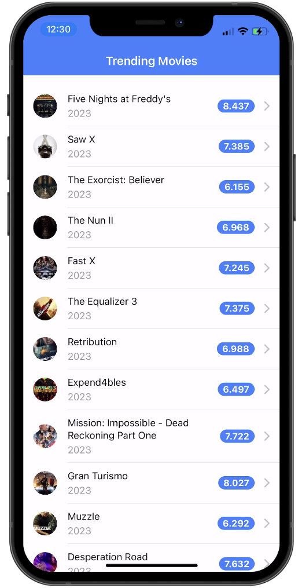

## Ionic with Angular 17 & Standalone Components

This project demonstrates how to use Angular 17 features with the latest versions of [Ionic Framework](https://ionicframework.com) and [Capacitor](https://capacitorjs.com) to build a cross-platform app.

### Features

- Ionic UI Components as Standalone Components
- Angular 17 Control Flow
- Route Parameter Binding
- Signals
- Inline Overlays
- ESBuild

### Run the app

This app uses [The Movie Database](https://www.themoviedb.org/) API to load data.

You can sign up to get an API key [here](https://www.themoviedb.org/settings/api).

Once you have your API key, edit the `environment.ts` in the `src/environments` and insert your API key!

Install the dependencies and run the app in the browser:

```bash
npm install
ionic serve
```

## Disclaimer

This repository was created with the Angular 17.0.0-rc.1

## Preview
<div style="display: flex; flex-direction: 'row';">


</div>
